# 🧠 Smart Task Manager

A modern **Task Management Flutter App** with full CRUD operations — built using **Flutter, Dart, REST API**, and **Provider State Management**.  
Users can create, update status, delete, and track tasks based on their progress: **New**, **In Progress**, **Completed**, and **Cancelled**.  
Includes authentication with **Email, Password, OTP Verification**, and **Profile Management** with image upload support.

---

## 🚀 Features

### 📝 Task Management
- ➕ Add new tasks
- 🧾 View all tasks (New, In Progress, Completed, Cancelled)
- ✏️ Update task status
- ❌ Delete tasks
- 📊 View total task count and progress summary

### 👤 Authentication
- 🔐 Login with email & password
- 🆕 Register new account
- 🔄 Forgot password with OTP verification
- 📩 Reset password with new credentials

### 🧍 Profile Section
- 👤 Update user info
- 🖼️ Upload profile image
- 🚪 Logout confirmation dialog

### ⚙️ Others
- 💾 Local data storage with **SharedPreferences**
- 🌐 REST API Integration
- 🪄 Splash Screen
- 🧭 Smart navigation (login → dashboard / login screen)
- 📱 Custom App Icon & App Name

---

## 🛠️ Tech Stack

| Category | Technology |
|-----------|-------------|
| **Framework** | Flutter |
| **Language** | Dart |
| **State Management** | Provider |
| **Backend** | REST API |
| **Local Storage** | SharedPreferences |
| **Logger** | Logger Package |
| **Splash Screen** | flutter_native_splash |
| **App Icon & Name** | flutter_launcher_icons, rename |
| **Image Picker** | image_picker |
| **OTP Input** | pin_code_fields |

---

## 📸 Screenshots

| Screen | Preview                                                |
|---------|--------------------------------------------------------|
| 🧾 Login |                 |
| 🆕 Signup | 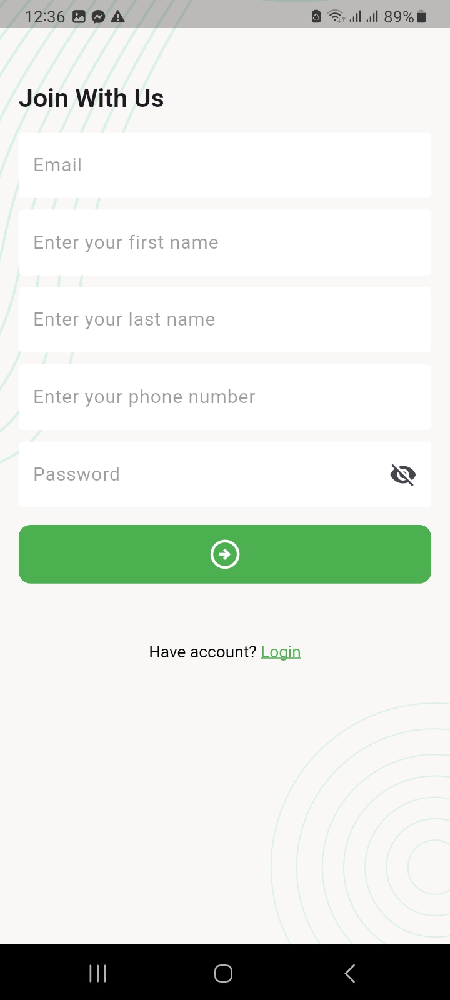               |
| 🔑 Forgot Password | 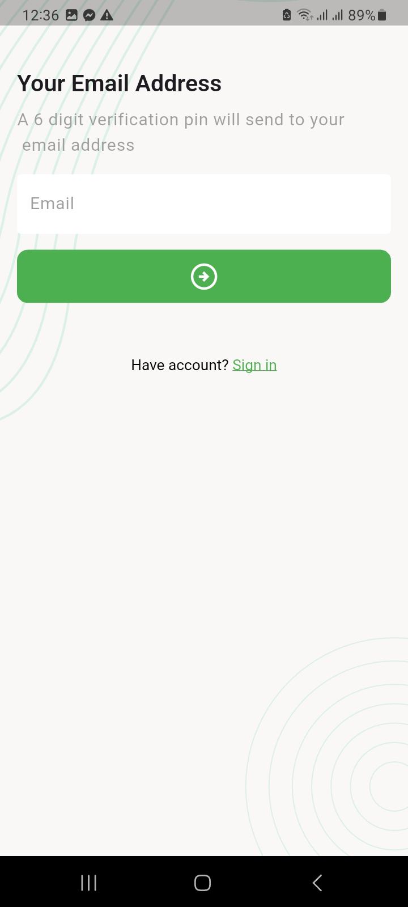 |
| ✉️ OTP Verify | 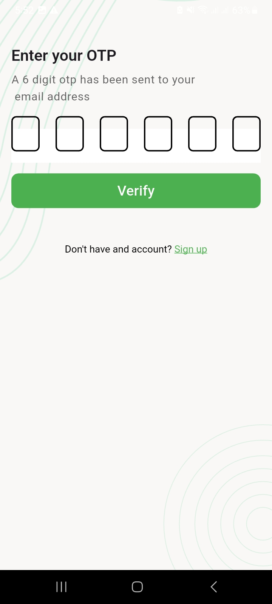                     |
| 🔒 New Password | 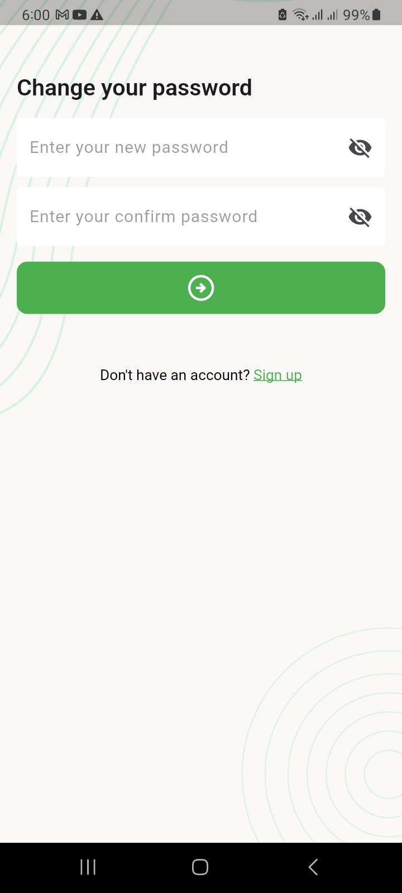       |
| 🏠 Dashboard | 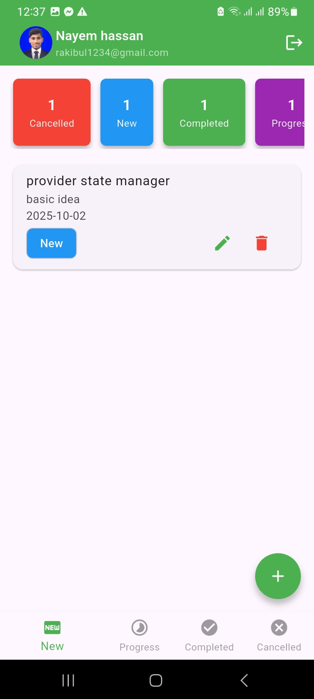             |
| 🆕 New Task | 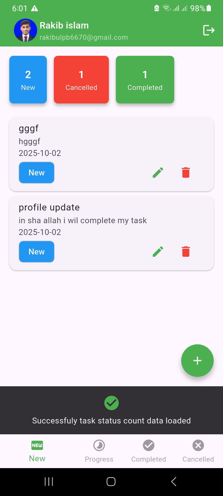               |
| 🚧 Progress Task | 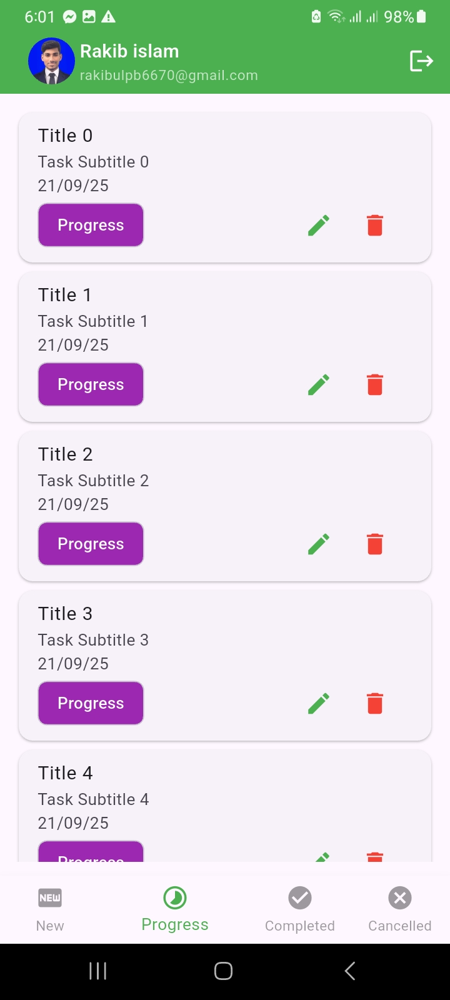     |
| ✅ Completed Task | 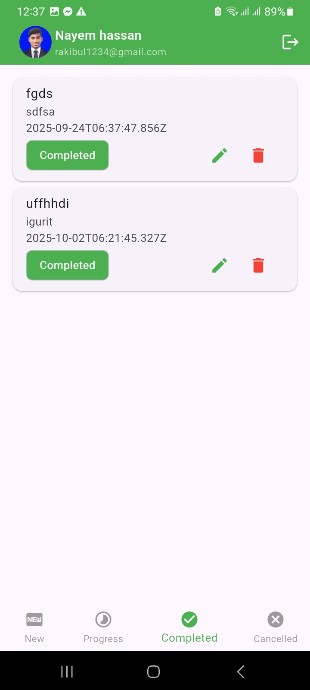   |
| ❌ Cancelled Task | 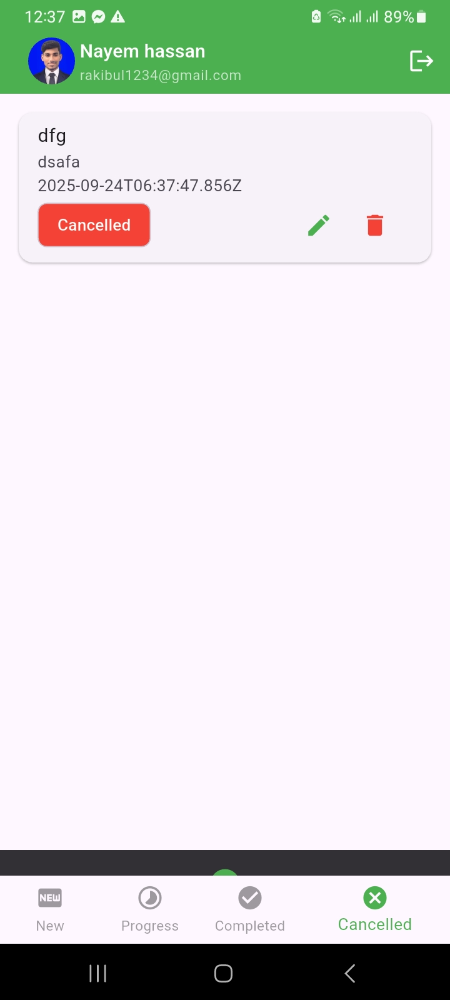   |
| 🧍 Profile Update | 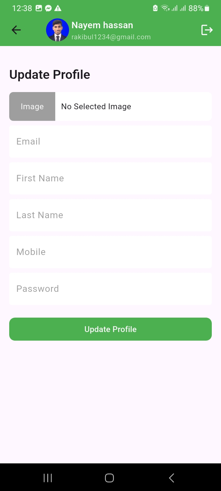                 |
| 🚪 Logout Dialog | 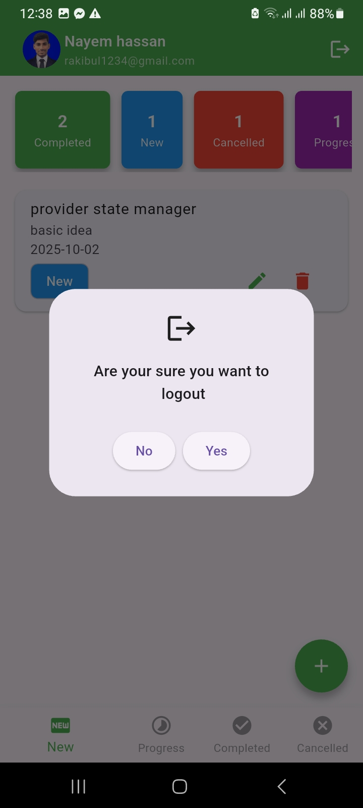            |

💡 **Developed by [Rakibul Hossain](https://github.com/rakibul6670)**  
🚀 Powered by Flutter & REST API
